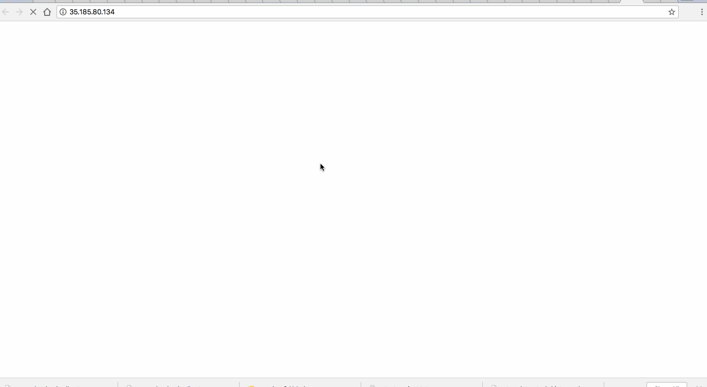

# Week-9-assignment
Time spent: 8 hours spent in total

I deployed Honeypot dionaea by the name ubuntu-trusty-1. 
Unfortunatly most of the time I spent on setting up and deploying honeypot. Due to the approaching deadline of the assignmrnt i couldn't hold honeypot opened for a long time. Because of that very little data was collected. Only 1 attack was detected. 

